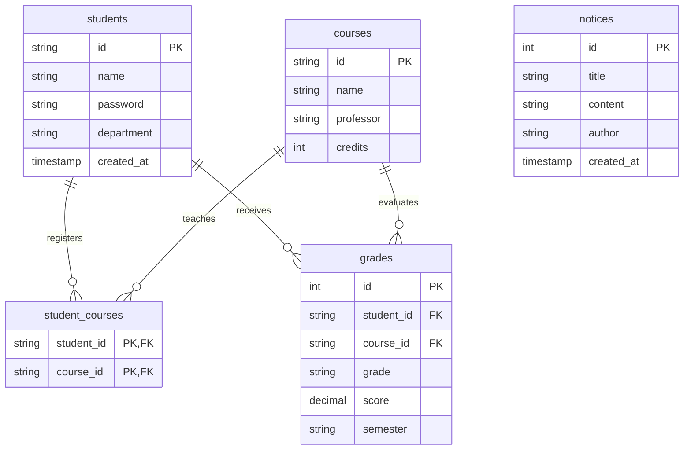

# wku-ai-chat Entity Relationship Diagram (ERD)

```mermaid
erDiagram
    students ||--o{ student_courses : registers
    courses ||--o{ student_courses : teaches
    students ||--o{ grades : receives
    courses ||--o{ grades : evaluates
    
    students {
        string id PK
        string name
        string password
        string department
        timestamp created_at
    }

    notices {
        int id PK
        string title
        string content
        string author
        timestamp created_at
    }

    courses {
        string id PK
        string name
        string professor
        int credits
    }

    student_courses {
        string student_id PK, FK
        string course_id PK, FK
    }

    grades {
        int id PK
        string student_id FK
        string course_id FK
        string grade
        decimal score
        string semester
    }
```
