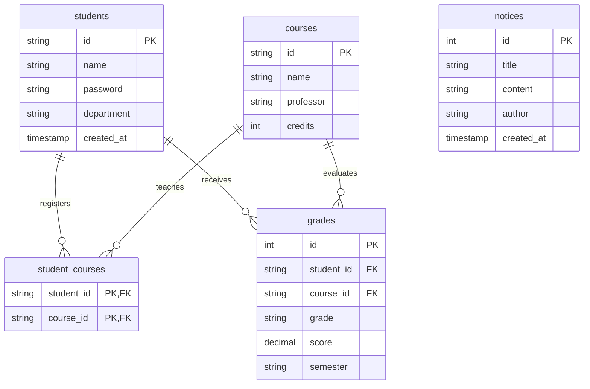

# wku-ai-chat Entity Relationship Diagram (ERD)



## 규정 판단 엔진 (db/schema.sql 7.5절)

위 다이어그램은 초기 구조라 현재 스키마 전체를 담지 않는다. 아래는 규정 판단 엔진(`server/services/regulationEngine`)이 쓰는 테이블만 그린 것이다.
`regulation_documents`/`regulation_chunks`(챗봇 검색용, 재시딩 때 통째로 교체)와는 일부러 분리했다 — 이유는 `docs/regulation-engine/DECISIONS.md` D-24.

```mermaid
erDiagram
    regulation_versions ||--o{ regulation_articles : contains
    regulation_versions |o--o| regulation_versions : supersedes
    regulation_articles ||--o{ regulation_relations : from
    regulation_articles |o--o{ regulation_relations : to
    regulation_articles |o--o{ regulation_applicability : scoped_by
    departments |o--o{ course_equivalences : designates
    departments |o--o{ course_category_overrides : overrides

    regulation_versions {
        int id PK
        string doc_code
        string version_label
        date promulgated_on "공포일"
        date effective_from "시행일"
        date effective_to
        int supersedes_version_id FK
        bool text_held "본문 보유 여부"
        enum date_confidence "CONFIRMED/ESTIMATED/UNKNOWN"
    }

    regulation_articles {
        int id PK
        int version_id FK
        string article_key "제13조 / 부칙(2026.04.10.)제2조 / 별표4-3"
        enum section "BODY/ADDENDUM/SCHEDULE"
        text body
        json amendment_markers "개정·신설 표시"
        date last_amended_on
    }

    regulation_applicability {
        int id PK
        string rule_code UK
        int article_id FK
        enum scope "COHORT_ONLY/ALL_ENROLLED/TRANSITIONAL"
        date applies_from
        int min_admission_year
        int max_admission_year
        enum enrollment_type
        string condition_code
        json condition_params
        enum confidence
        bool critical "0이면 전체 신뢰도에서 제외"
    }

    regulation_relations {
        int id PK
        int from_article_id FK
        enum relation "REFERS/DELEGATES_TO/OVERRIDES/AMENDS"
        int to_article_id FK
        string to_ref "보유하지 않은 대상"
        enum source "PARSED/MANUAL"
    }

    course_equivalences {
        int id PK
        int department_id FK
        string from_course_key
        string to_course_key
        string basis_article_ref "제15조"
    }

    course_category_overrides {
        int id PK
        int department_id FK
        string course_key
        int academic_year
        int semester
        string category
        string basis_article_ref "제13조④"
    }
```
