# ERD 설계 (초안)

> [API 설계](./API-설계.md) 0.6~0.7에서 정의한 데이터 모델을 실제 테이블 구조로 옮긴 문서입니다. 세부 데이터 값(과거 이력 과목, 학사일정 날짜 등)이 아직 안 정해진 것과 무관하게, **구조(테이블/컬럼/관계)는 이 문서로 확정**합니다.
> 현재 `db/schema.sql`의 `students / notices / courses / student_courses / grades`는 아래 구조로 대체·확장됩니다.

## 전체 ER 다이어그램

```mermaid
erDiagram
    colleges ||--o{ departments : has
    departments ||--o{ professors : employs
    departments ||--o{ templates : "used by"
    departments ||--o{ students : "belongs to"
    templates ||--o{ students : seeds
    professors ||--o{ students : advises

    courses ||--o{ course_offerings : "offered as"
    professors ||--o{ course_offerings : teaches

    students ||--o{ student_courses : registers
    course_offerings ||--o{ student_courses : "registered by"

    students ||--o{ grades : receives
    course_offerings ||--o{ grades : evaluates
    grades ||--o| grade_correction_requests : "corrected via"

    students ||--o{ attendance_records : has
    course_offerings ||--o{ attendance_records : tracks

    students ||--o{ official_leave_requests : submits
    course_offerings ||--o{ official_leave_requests : "for"

    students ||--o{ course_evaluations : submits
    course_offerings ||--o{ course_evaluations : "evaluated by"

    students ||--o{ leave_requests : submits
    students ||--o{ withdrawal_requests : submits
    withdrawal_requests ||--o| refund_requests : triggers
    students ||--o{ refund_requests : requests

    students ||--o{ tuition_invoices : has
    tuition_invoices ||--o{ tuition_invoice_items : contains

    students ||--o{ completed_course_items : has

    students ||--o{ home_shortcuts : configures
    shortcut_catalog ||--o{ home_shortcuts : "chosen from"

    students ||--o{ chat_conversations : has
    chat_conversations ||--o{ chat_messages : contains

    colleges {
        int id PK
        string name
    }
    departments {
        int id PK
        int college_id FK
        string name
    }
    professors {
        string id PK
        int department_id FK
        string name
    }
    templates {
        int id PK
        int department_id FK
        string name
    }
    students {
        string id PK "studentId, 자동발급"
        string email UK
        string password_hash
        string name
        int college_id FK
        int department_id FK
        int grade
        int admission_year
        string admission_type
        string advisor_professor_id FK
        int template_id FK
        string transfer_type
        int transfer_year
        string previous_department
        timestamp created_at
    }
    courses {
        string code PK "학수번호"
        string name
        decimal credits
        string category "기전/선전/교필/교선 등"
    }
    course_offerings {
        int id PK "offeringId, surrogate"
        string course_code FK
        int year
        int semester
        string section
        string professor_id FK
        string day_period
        string room
    }
    student_courses {
        string student_id PK, FK
        int offering_id PK, FK
        boolean is_retake
    }
    grades {
        int id PK "recordId"
        string student_id FK
        int offering_id FK
        decimal midterm
        decimal final
        decimal attendance_score
        decimal assignment
        decimal etc
        decimal gpa
        string letter_grade
    }
    grade_correction_requests {
        int id PK
        int grade_id FK, UK
        string reason
        timestamp requested_at
    }
    attendance_records {
        int id PK
        string student_id FK
        int offering_id FK
        int week
        date date
        int period
        string status "PRESENT/LATE/OFFICIAL_ABSENCE/ABSENCE"
        string category "지각/공결 사유"
    }
    official_leave_requests {
        int id PK
        string student_id FK
        int offering_id FK
        date applied_date
        date absence_date
        int period
        string reason
        string approval_status "표시용, PENDING 고정"
    }
    course_evaluations {
        int id PK
        string student_id FK, UK
        int offering_id FK, UK
        boolean submitted
        timestamp submitted_at
        json answers
    }
    leave_requests {
        int id PK
        string student_id FK
        string change_type "GENERAL/MILITARY/STARTUP/PARENTAL/RETURN"
        string reason
        int request_year
        int request_semester
        int return_year
        int return_semester
        string status "PENDING/CANCELLED"
        timestamp submitted_at
    }
    withdrawal_requests {
        int id PK
        string student_id FK
        string reason
        string status "PENDING/CANCELLED"
        int refund_request_id FK
        timestamp submitted_at
    }
    refund_requests {
        int id PK
        string student_id FK
        int withdrawal_request_id FK "nullable"
        int apply_year
        int apply_semester
        int reg_year
        int reg_semester
        string reason
        boolean personal_info_consent
        string refund_bank
        string refund_account_number
        string refund_holder_name
        date refund_base_date
        timestamp submitted_at
        timestamp refunded_at
        decimal refund_amount
        string result
    }
    tuition_invoices {
        int id PK
        string student_id FK
        int year
        int semester
        decimal total_amount
    }
    tuition_invoice_items {
        int id PK
        int invoice_id FK
        string name
        decimal amount
    }
    tuition_schedules {
        int id PK
        int year
        int semester
        string target_group
        string period
        string print_period
        string available_banks
    }
    completed_course_items {
        int id PK
        string student_id FK
        string group_type "교양/전공/기타"
        string type "교필/교선/기전/선전 등"
        string course_name
        string year_semester
        decimal credits
        string area_or_department
        string note
    }
    academic_calendar {
        int id PK
        string type "LEAVE_APPLICATION 등"
        int year
        int semester
        date start_date
        date end_date
    }
    home_shortcuts {
        string student_id PK, FK
        string shortcut_key PK, FK
        int display_order
    }
    shortcut_catalog {
        string key PK
        string label
        string icon
    }
    chat_conversations {
        string id PK
        string student_id FK
        timestamp created_at
        timestamp last_active_at
    }
    chat_messages {
        int id PK
        string conversation_id FK
        string role "user/assistant/tool"
        text content
        json tool_calls
        timestamp created_at
    }
```

---

## 설계 노트 (구조적 결정 사항)

### 1. `course_offerings` — surrogate key + 복합 유니크
[API 설계 0.6](./API-설계.md#06-새로-필요한-데이터-모델)에서 이미 확정한 대로, `courses`(과목 마스터)와 `course_offerings`(학기별 개설강좌)를 분리했습니다. `course_offerings.id`(offeringId)를 자동증가 surrogate PK로 쓰고, `UNIQUE(course_code, year, semester, section)`으로 실질적인 복합키 역할을 하게 했습니다. `student_courses`, `grades`, `attendance_records`, `official_leave_requests`, `course_evaluations`가 전부 `offering_id` 하나만 참조합니다.

### 2. "현재 학기 성적/출결"과 "과거 이력"을 완전히 분리
- `grades`, `attendance_records`, `course_evaluations`는 **`course_offerings`를 참조** — 즉 지금 시드된 10개 과목(현재 학기) 기준으로만 존재합니다.
- `completed_course_items`는 **`course_offerings`를 참조하지 않는 독립 테이블**입니다. 이수과목확인리스트·전체성적조회 화면에 나오는 "이미 지나간 학기의 과목들"은 애초에 `course_offerings`로 모델링된 적 없는 과거 데이터라, 과목명/학점/영역 등을 플랫하게 저장합니다. (API 설계 0.7에서 이미 합의된 내용)
- 요약 표(교양/전공/기타 이수학점 합계)는 별도 테이블 없이 `completed_course_items`를 `group_type`/`type` 기준으로 `SUM(credits)` 집계해서 계산합니다 — 정적 mock 데이터라 매번 계산해도 비용이 없고, 요약값을 따로 저장하면 원본과 어긋날 위험만 생기기 때문입니다.

### 3. `leave_requests` / `withdrawal_requests` 분리
API 설계 0.6 프로즈에는 "휴복학/자퇴"를 묶어서 설명했지만, 실제 API가 `/academic-status/leave`와 `/academic-status/withdrawal`로 완전히 분리되어 있고 휴학은 `changeType`/`returnYear` 같은 자퇴에 없는 필드를 가지므로, 테이블도 두 개로 나눴습니다. 휴학·복학은 여전히 `leave_requests` 한 테이블에서 `change_type`으로 구분합니다 (API 설계와 동일한 결정).

### 4. `withdrawal_requests` ↔ `refund_requests` 상호 참조
자퇴 확정 후 "환불신청" 버튼으로 연결되는 관계를 양방향으로 잡았습니다: `refund_requests.withdrawal_request_id`(선택값)로 어떤 자퇴 때문인지 기록하고, `withdrawal_requests.refund_request_id`로 역참조합니다. 자퇴와 무관한 환불(등록금 과오납 등)은 `withdrawal_request_id`를 비워두면 됩니다.

### 5. `templates` 테이블 (확장 대비)
지금은 템플릿이 컴퓨터·소프트웨어공학과 1개뿐이지만, 나중에 템플릿이 늘어날 걸 대비해 `templates`(학과별 템플릿 마스터)를 두고 `students.template_id`로 참조하게 했습니다. 신규 가입 시 이 템플릿의 시드 데이터(과목/시간표/성적/출결)를 학생 소유 행으로 복사하는 로직은 API 설계 0.7 그대로입니다.

### 6. `home_shortcuts` / `shortcut_catalog`
"+" 버튼으로 고를 수 있는 후보 전체 목록을 `shortcut_catalog`(공용 마스터)로 두고, 학생이 실제로 설정한 것만 `home_shortcuts`에 저장합니다.

### 7. 익명성 관련 — `course_evaluations`
학생이 어떤 답을 냈는지(`answers`)는 저장하지만 `student_id`가 테이블에 남아있어 완전한 익명은 아닙니다. "과목당 1회 제출"을 DB 유니크 제약(`UNIQUE(student_id, offering_id)`)으로 강제하려면 최소한의 식별자는 남아야 해서, API 설계 5.5에서 이미 언급한 "완전 익명 vs 중복제출 방지" 트레이드오프를 최소 식별 쪽으로 확정한 형태입니다.

---

## 기존 `db/schema.sql`과의 관계
현재 구현된 `courses` (id/name/professor/credits 단일 테이블)와 `student_courses`(student_id+course_id만 있는 단순 조인 테이블), `grades`(semester를 문자열로만 가짐)는 위 구조로 완전히 대체됩니다. 실제 마이그레이션(스키마 변경 SQL)은 구현 단계에서 별도로 작성합니다 — 이 문서는 설계 확정용입니다.
